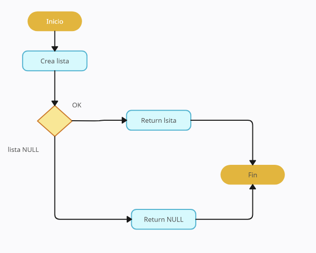
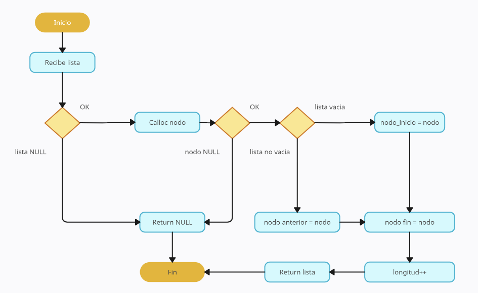
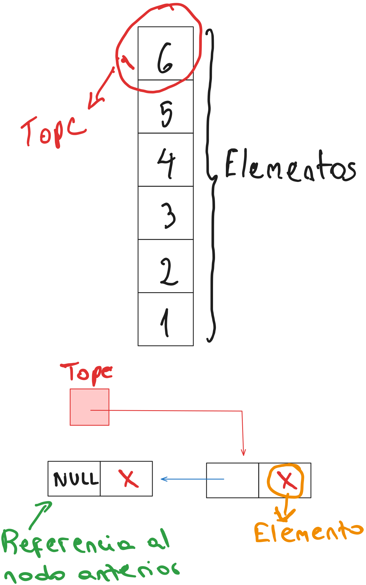
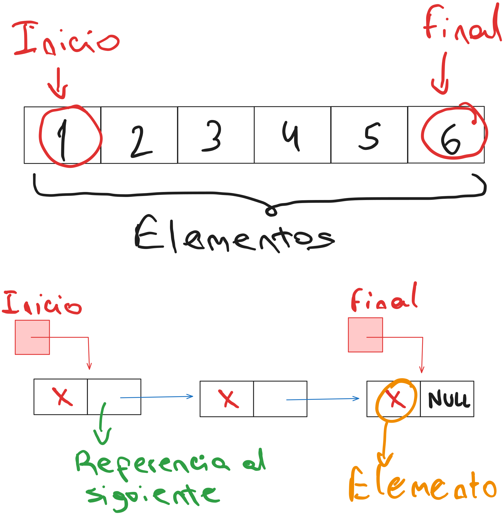

<div align="right">

</div>

# NOMBRE TP/TDA

## Repositorio de Lucas Aldonate - 100030 - laldonate@fi.uba.ar

- Para compilar:

```bash
make pruebas_chanutron
```

- Para ejecutar:

```bash
./pruebas_chanutron
```

- Para ejecutar con valgrind:
```bash
make valgrind-chanutron
```
---
##  Funcionamiento

Inicialmente se crea la lista, en caso de que no haya ningún error, se puede proceder a utilizar las distintas operaciones.
Es importante a la hora de insertar/quitar, no perder las referencias que ya se tienen de los nodos. En el caso de insertar
por ejemplo al medio, el nodo de la posición anterior debe apuntar al nuevo nodo a insertar, y este debe apuntar al siguiente.
Para no perder ninguna referencia, primero el nuevo nodo debe apuntar a su siguiente, y luego el nodo anterior puede apuntar
tranquilamente al nodo nuevo como su siguiente.
En el caso de eliminar un nodo de X posición, se debe utilizar un auxiliar que apunte al nodo a eliminar, luego el nodo anterior
a este debe apuntar al siguiente del nodo a eliminar y finalmente se puede eliminar.
A continuación un diagrama para la creación de la lista y otro para la inserción al final, así se puede entender un poco mejor
el funcionamiento del tda:

`lista_crear`

<div align="center">

</div>

`lista_insertar`

<div align="center">

</div>

---

## Respuestas a las preguntas teóricas

### Respuesta 1

Pila:

La pila es una estructura de datos en donde elementos pueden ser añadidos o eliminados por el final de esta misma. Es decir,
los elementos pueden ser "apilados" o "desapilados". A continuación un diagrama de una implementación de pila con nodos
simplemente enlazados:

<div align="center">

</div>

Cola:

La cola al igual que la pila es una estructura de datos. Lo que las diferencia, es que en el caso de la cola los elementos
se agregan por el inicio y se quitan por el final. En este caso los elementos se "encolan" y se "desencolan". A continuación,
un diagrama explicando el funcionamiento:

<div align="center">

</div>

Lista:

Finalmente, la lista es otra estructura de datos, que combina las funcionalidades de la pila y la cola. Podríamos entonces decir 
que la pila y la cola son casos particulares de una lista. La diferencia principal, es que en la lista se puede insertar y quitar
elementos de posiciones que no necesariamente sean el inicio o el final.

### Respuesta 2

Lista simplemente enlazada:

- Inicio

    - Insertar: tiene complejidad O(1), ya que con el puntero al nodo inicial, simplemente se agrega el nuevo nodo y su siguiente 
    apuntará al anterior nodo inicial.
    - Obtener: tambien complejidad O(1), simplemente se muestra el elemento del nodo incial.
    - Eliminar: como en las dos anteriores, complejidad O(1). Se elimina el nodo, haciendo como paso previo que el nodo contiguo
    pase a ser el nodo inicial (al revés que en insertar al inicio).

- Medio/Final

    - Insertar: insertar al final tiene complejidad O(n), ya que se deben recorrer todos los nodos hasta llegar al último. En caso 
    de utilizar un puntero al nodo final (como es el caso de la implementación de este TP), la complejidad pasa a ser O(1). En el 
    caso de insertar al medio, siempre será O(n).
    - Obtener: lo mismo que para insertar.
    - Eliminar: lo mismo que en las dos anteriores.

Lista doblemente enlazada:

Posee las mismas complejidades que la lista simplemente enlazada con una salvedad. Debido a que es posible recorrer la lista en 
ambos sentidos, las operaciones del medio poseen una complejidad O(n/2).

Vector dinámico:

- Inicio

    - Insertar: tiene complejidad O(n), debido a que al insertar al inicio conlleva el desplazamiento de todos los elementos 
    hacia la derecha. 
    - Obtener: en este caso, a diferencia de la implementación con nodos, la complejidad es O(1). Esto se debe a que al ser
    un vector, directamente se puede acceder a la posicion deseada y obtener el elemento:

    ```c
    void *lista_elemento_en_posicion(lista_t *lista, size_t posicion)
    {
        return lista[posicion];
    }
    ```

    - Eliminar: al igual que insertar, se deben desplazar el resto de elementos, por ende la complejidad es O(n)

- Medio/Final

    - Insertar: en el caso del medio de la lista, complejidad O(n). Se debe desplazar los elementos luego de la inserción.
    Pero insertar al final generalmente es O(1), salvo el caso particular dónde el vector no tenga mas espacio, por lo que
    habría que hacer una redimensión del vector dinámico, lo que conllevaría una complejidad O(n). Concluyendo, tiene
    complejidad O(1), y O(n) en el peor de los casos.
    - Obtener: al igual que al inicio, tanto en el medio como el final, la complejidad es O(1).
    - Eliminar: al final es complejidad O(1), se inserta al final y no hay nada que desplazar. En el caso del medio, la 
    complejidad es O(n) como en el caso de la inserción.

### Respuesta 3

Es importante destacar la manera de reutilizar las funciones implementadas para la lista, tanto en la pila como en la cola.
En el caso de la funcion `lista_insertar_en_posicion`, al reutilizarla en la posición 0 en la funcion `pila_apilar` se logra
una complejidad O(1) a pesar de que originalmente tiene una complejidad O(n). Esto se debe a que no es necesario hacer ningún
recorrido, simplemente insertar al inicio, esta es la operación mas "barata". Lo mismo sucede con la funcion `lista_quitar_de_posicion`
tanto para las funcion `pila_desapilar` como también `cola_desencolar`.

Finalmente para el caso de `cola_encolar`, si bien la función `lista_insertar` (que es la función que se reutilizó) generalmente tiene 
complejidad O(n), en esta implementación se utilizó un puntero al ultimo nodo para que sea O(1) y poder reutilizarla para encolar de 
manera que tambien esta última tenga esa misma complejidad.